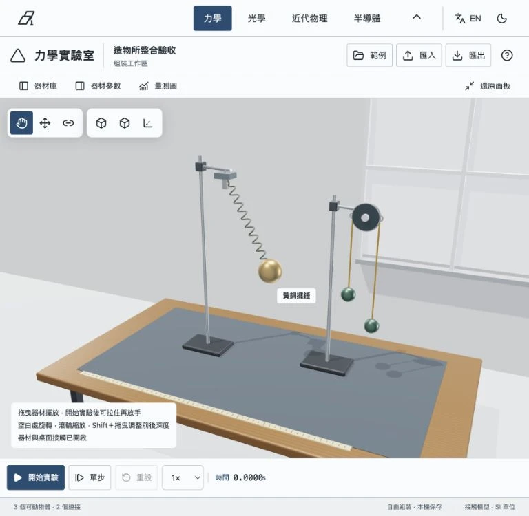
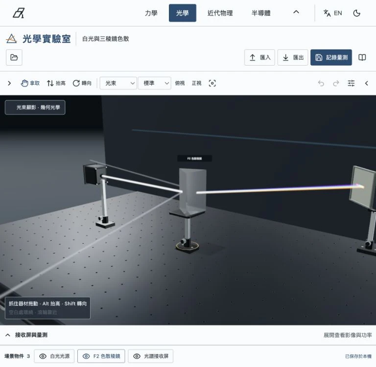
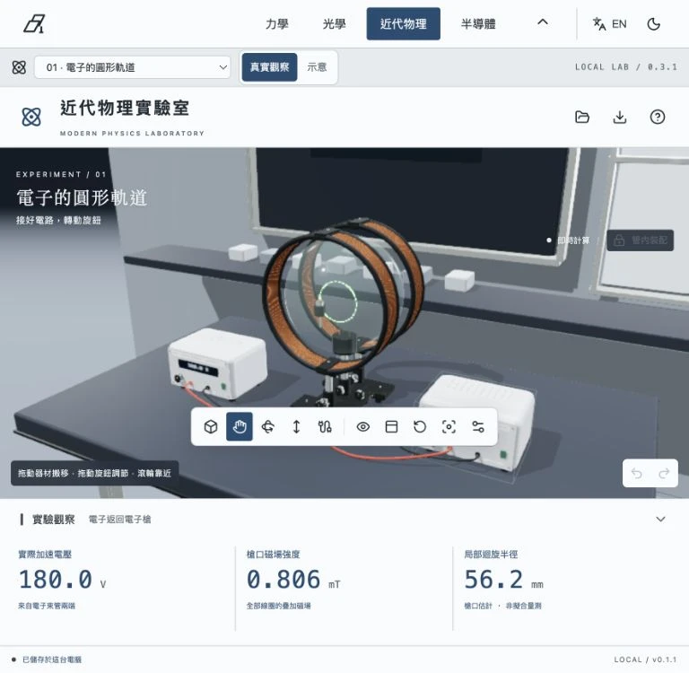
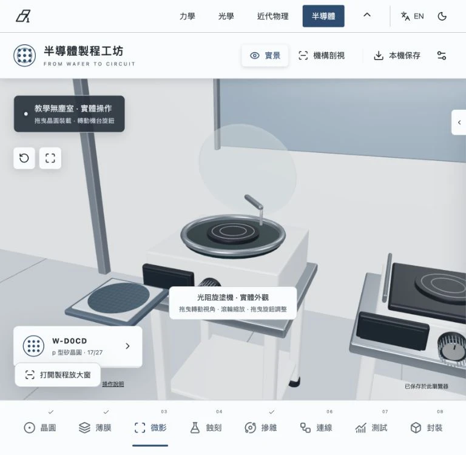

# 物理造物所 · Physics Foundry

**[開啟網站／Open the laboratory](https://changyi123456.github.io/mechanics-laboratory-web/)**

把想法放上實驗桌。自由組裝力學裝置、安排光學路徑、調整粒子實驗，或親手走過半導體製程。網站直接在瀏覽器運作，免安裝、免登入。

提供 **繁體中文／English** 與 **淺色／深色介面**，涵蓋入口、實驗室操作、元件說明及教學內容。右上角可切換，偏好會保留。建議使用配有滑鼠的電腦；小螢幕可收合面板，但精細組裝以桌機操作較方便。

## 四個實驗區

| 實驗區 | 操作與觀察 |
|---|---|
| [力學](https://changyi123456.github.io/mechanics-laboratory-web/#/lab/mechanics) | 連接彈簧、繩索、滑輪、槓桿與轉軸；抓住物體拉動再放手，查看運動、張力、力矩與能量。 |
| [光學](https://changyi123456.github.io/mechanics-laboratory-web/#/lab/optics) | 搬動光源、透鏡與反射鏡，觀察成像與色散；用狹縫、光柵和偏振元件探索波動光學。 |
| [近代物理](https://changyi123456.github.io/mechanics-laboratory-web/#/lab/modern) | 配置儀器、接線與轉動旋鈕，觀察電場、磁場與粒子；提供真實觀察與示意模式。 |
| [半導體製程](https://changyi123456.github.io/mechanics-laboratory-web/#/lab/semiconductor) | 24 台專用設備、27 個製程節點、155 個子步驟；觀察實體操作、機構剖視與加工前後材料變化。 |

以上縮圖來自實際程式畫面。入口大型工作桌圖片為概念視覺，真正的器材操作與計算發生在實驗室內。

## 第一次操作

1. 選擇一個實驗室，從內建範例開始。
2. 每次改一個條件：質量、鏡片角度、電源電壓或製程時間，再觀察結果。
3. 按「專注實驗」或收合左右面板，放大實驗空間。
4. 等待本機保存完成；力學試跑先按「返回編輯」，光學先結束量測記錄，半導體先完成當前加工。
5. 用上方導覽切換實驗室；入口的「我的實驗」可重新開啟這個瀏覽器的存檔。

語言切換會先保存配置，再重新建立當前場景，以更新設備標籤。亮暗切換改變操作介面，保留場景照明、光譜及材料示意色彩。

## 力學實驗室

17 種器材庫項目，11 個範例配置與空白實驗。物體可自由懸掛，會受重力影響；運動限制來自實際連接的元件。

- **物體與支撐**：砝碼、固定支點、滑輪、多孔桿／槓桿、剛性板、圓盤／輪軸、圓環、飛輪。
- **連接與作用**：彈簧、繩索、無質量連桿、阻尼器。
- **接頭與旋轉**：轉軸／軸承、球接頭、固定夾具、扭轉彈簧、旋轉阻尼器。
- **範例**：自由彈簧、空間單擺、阿特伍德機、動滑輪、彈簧與滑輪、耦合振子，以及彈簧槓桿、實體雙擺、偏心配重輪與扭擺等。
- **量測**：位置、速度、張力、轉角、力矩、轉動動能與系統能量；可保存試跑、比較曲線、匯出 CSV。

彈簧採沿掛點方向的彈性力與相對速度阻尼。圈線顯示追隨求解結果，沒有自行驅動的擺動。繩索只能拉、能鬆弛；無質量連桿與有質量的槓桿是不同元件。模型中的理想約束、接觸近似與數值誤差詳見實驗室說明。

## 光學實驗室

- **光源**：準直光、點光源、圖樣光箱、白光及相干雷射。
- **幾何元件**：平面鏡、凹凸球面鏡、分光鏡、正負透鏡、柱面透鏡、玻璃塊、三稜鏡、遮光板與接收屏。
- **物理光學**：可調單狹縫、雙狹縫、多狹縫光柵、圓孔、濾光片、線偏振片、半波片及四分之一波片。
- **裝配**：光學麵包板、底座升降柱、可傾鏡架與平移台；父元件移動可帶動整組器材。

白光使用 400–700 nm 的 31 個波段；N-BK7 與 F2 玻璃的色散使不同波長自然分開。幾何光線依元件表面計算反射、折射及遮擋；相干光以二維複數波場計算干涉與繞射。波動模型需要符合元件平面關係，並非任意三維 Maxwell 全波求解器。空氣中的可見光路屬於顯影示意。

## 近代物理實驗室

| 編號 | 實驗 | 可改變的條件 |
|---|---|---|
| 01 | 電子的圓形軌道 | 加速電壓、線圈電流、線圈與電子槍方位、接線與裝配 |
| 02 | 磁偏轉質譜儀 | 離子質量／電荷、加速電壓、分析磁場、狹縫與探測位置 |
| 03 | 迴旋加速器 | 磁場、射頻電壓／頻率／相位、D 形電極與引出條件 |
| 04 | 密立根油滴 | 油滴、極板電壓與運動觀察 |
| 05 | 拉塞福散射 | 薄箔材料與厚度、入射條件、探測角度與位置 |
| 06 | 光電效應 | 波長、光源功率、陰極材料、偏壓與光電流 |

**真實觀察**呈現裝置能實際觀測的訊號，例如低壓氣體中的電子束顯影、屏幕訊號與儀表；**示意**可顯示剖面與粒子路徑。真空中的任意粒子路徑並不都能直接看見，動畫的空間與時間尺度亦可能為教學調整。各桌面的觀察說明會指出模型範圍。

## 半導體製程工坊

八個工作區：晶圓、薄膜、微影、蝕刻、摻雜、連線、測試、封裝。不同子步驟會使用不同設備與操作機構，包含濕式清洗、旋乾、氧化爐、薄膜沉積、光阻旋塗、軟烤、光罩對準、曝光、顯影、乾式蝕刻、離子植入、退火、金屬沉積、探針測試、切割、取晶、固晶、打線、模封與最終測試。

- **設備實景／機構剖視**：觀察加工設備外殼、工作區、真空腔、電極及操作機構。
- **製程機制放大**：顯示旋塗流動、曝光、顯影開窗、蝕刻移除、摻雜分布或封裝機構的意義。
- **核心材料／完整晶粒**：使用兩個不同尺度，對照材料厚度、遮罩、接觸孔、連線及接墊。
- **加工前後對照與回看**：比較材料變化；回看為唯讀，不寫入晶圓狀態。
- **配方影響結果**：時間、溫度、劑量、對準偏差和切割條件會影響教學模型中的材料與電性。

這是高中教學用的簡化元件製作路徑，並非完整先進 CMOS 生產線或可直接操作真實機台的配方。奈米材料厚度、粒子與加工動畫經放大；色彩用來辨識材料，並非肉眼可見的實際外觀。

## 存檔與隱私

- 實驗資料保存在自己的瀏覽器 IndexedDB；網站不需要帳號，也不將實驗內容上傳 GitHub。
- 原公開力學網站的存檔沿用相同資料庫，不因入口與路徑調整而清除。
- 「我的實驗」列出四個實驗區的本機記錄。各實驗室保留原有的匯出／匯入功能。
- localhost、不同連接埠、不同網站或瀏覽器不共享存檔，請先從原實驗室匯出再匯入。
- 清除網站資料、無痕瀏覽結束或瀏覽器儲存空間回收可能移除記錄；重要實驗請另外匯出備份。
- 自訂名稱和數值保持原樣；中英文切換不改寫存檔或 CSV。

## 技術與開源資源

使用 React、TypeScript、Vite、Three.js、Web Workers、IndexedDB 與 fflate。半導體設備以 Blender 製作並輸出 GLB；其餘器材以參數化幾何構建。第三方授權見 [licenses](licenses/)。首頁概念圖由影像生成工具製作；場景縮圖為實際程式截圖。

此 repository 延續原網站發布方式，包含建置後的靜態網站與說明。完整開發原始碼保存在專案本機資料夾；這不是可直接 `npm install` 的原始碼 repository。

## English

Physics Foundry brings four interactive 3D teaching environments together: mechanics, optics, modern physics and semiconductor fabrication. Open the website and select **EN** in the header to switch the controls, component descriptions and teaching notes to English. Light and dark interface modes are available throughout the site.

Start from a prepared experiment, change one condition and observe the result. You can collapse panels for a larger workspace. Save before leaving: return mechanics runs to editing, finish optical measurement recording, and complete the current fabrication operation. Your experiments stay in your own browser and can be exported from each laboratory.

The modern physics benches include electron orbits, magnetic mass spectrometry, a cyclotron, the Millikan oil-drop experiment, Rutherford scattering and the photoelectric effect. Realistic observation and schematic views distinguish visible instrument signals from explanatory particle paths. The semiconductor workshop includes 24 dedicated machines, 27 process nodes and 155 operation steps, with enlarged mechanism and material views.

These are educational models. Beam visibility, animation speed, microscopic dimensions and material colors may be exaggerated for explanation. The fabrication sequence is not an industrial process recipe. Desktop use with a mouse is recommended for detailed assembly.
