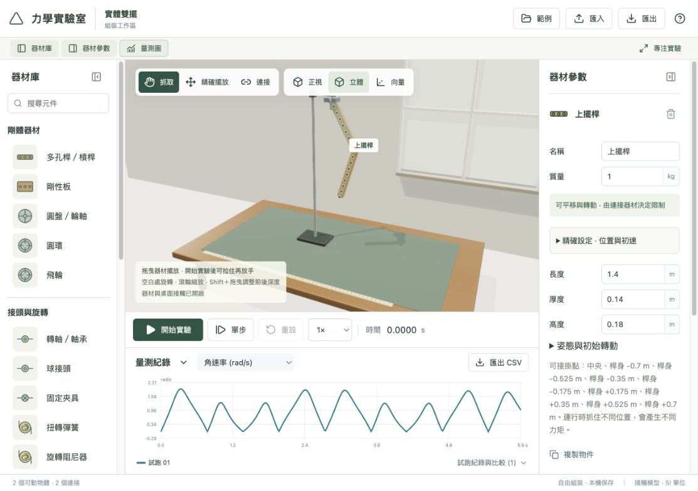

# 力學實驗室・線上版

**[立即開啟力學實驗室](https://changyi123456.github.io/mechanics-laboratory-web/)**

在三維實驗空間中，自由擺放砝碼、連接彈簧與繩索、組裝槓桿和轉軸，觀察裝置如何受重力、張力與力矩影響。你可以從教學範例開始拆改，也可以從空白場景組裝自己的機構。

目前版本 **0.4.0**，提供 **17 種器材庫項目**、**11 個範例配置與空白實驗**。使用瀏覽器即可操作，免安裝、免登入；建議使用配有滑鼠的電腦或筆電。

## 這裡可以做什麼？

- **自由組裝**：把砝碼、桿件、板件或輪盤接在不同掛點，探索新的裝置。
- **保留物理世界的運動**：自由物體會受重力影響，彈簧裝置會伸展和下垂；運動限制來自實際連接的繩索、連桿或接頭。
- **操作中的介入**：開始實驗後拉住器材再放手，觀察原本的運動如何改變；剛體的偏心抓取會產生轉動。
- **查看物理量**：位置、速度、張力、轉角、力矩和能量都能在數值面板或曲線中觀察。
- **比較不同設計**：保存一輪試跑，修改質量、掛點或剛度後再跑一次，比較曲線。
- **保存與搬移**：草稿與試跑保存在自己的瀏覽器，可匯出實驗檔或 CSV。

## 第一次遊玩

1. [開啟網站](https://changyi123456.github.io/mechanics-laboratory-web/)，點上方「範例」。
2. 選「自由彈簧實驗桌」觀察彈簧與滑輪，或選「實體雙擺」體驗有質量桿件的轉動。
3. 點「開始實驗」。用滑鼠抓住器材拉動，再放手，看看裝置如何回應。
4. 點「暫停」查看當下數值；可「單步」或選擇 0.25×、0.5× 慢放。
5. 點「返回編輯」保存這輪試跑，再修改器材參數或連接方式。
6. 想讓實驗畫面更大，按「專注實驗」，或分別收合器材庫、器材參數、量測圖。

範例會建立可編輯的實驗副本，修改自己的配置不會改動內建範例。

## 器材庫

### 物體與剛體

| 元件 | 可以用來做什麼 |
|---|---|
| 砝碼 | 提供負載、懸掛配重，或與其他器材組合 |
| 固定支點 | 懸掛彈簧、繩索與接頭，提供固定連接位置 |
| 滑輪 | 引導穿繩路徑；可設為固定滑輪或帶質量載體的動滑輪 |
| 多孔桿／槓桿 | 有質量與轉動慣量的桿件，提供九個預設掛點，可作槓桿或實體擺 |
| 剛性板 | 中央與四角可連接，可探索偏心懸掛和三維轉動 |
| 圓盤／輪軸 | 有厚度的實心輪盤，能在中心或輪緣接上其他元件 |
| 圓環 | 以環形質量分布計算慣量，可與圓盤比較轉動行為 |
| 飛輪 | 用於配重輪與旋轉裝置，目前採環形慣量模型 |

### 連接與接頭

| 元件 | 作用 |
|---|---|
| 彈簧 | 沿兩掛點方向產生彈性力，可調自然長度、剛度及阻尼 |
| 繩索 | 限制總繩長，可鬆弛；能拉、不能推，也可穿過多個滑輪 |
| 連桿 | 無質量的兩點定長約束，適合組裝理想單擺；桿身沒有自身慣量 |
| 阻尼器 | 依兩端軸向相對速度產生阻力 |
| 轉軸／軸承 | 接合兩掛點，保留兩件器材之間的繞軸相對轉動 |
| 球接頭 | 保持掛點重合，允許相對三維轉動 |
| 固定夾具 | 保持相對位置和姿態，例如把配重固定在輪盤上 |
| 扭轉彈簧 | 安裝於轉軸，偏離平衡角時產生回復力矩 |
| 旋轉阻尼器 | 安裝於轉軸，依相對角速度產生阻尼力矩 |

「連桿」與「多孔桿／槓桿」是不同模型：前者是無質量的距離限制，後者是有質量、尺寸與慣量的實體桿件。

## 內建範例

| 起始選項 | 可以觀察或改造的重點 |
|---|---|
| **彈簧槓桿** | 一側掛砝碼、另一側接彈簧；改掛點與力臂，觀察轉動和平衡 |
| **實體雙擺** | 兩根有質量的桿以轉軸串接；改變桿長、質量或初始方向 |
| **偏心配重輪** | 飛輪上固定偏心砝碼；觀察重力力矩和旋轉阻尼 |
| **扭擺** | 圓盤、轉軸、扭轉彈簧與旋轉阻尼；比較週期和衰減 |
| 自由彈簧實驗桌 | 拉斜砝碼後放手，觀察伸縮、側擺與環境接觸 |
| 彈簧與滑輪 | 從兩組裝置出發，重新連接彈簧、繩索與負載 |
| 彈簧振子 | 改變質量、彈簧剛度或阻尼，觀察振動 |
| 阿特伍德機 | 兩顆自由砝碼共用繩路，比較質量差、加速度與張力 |
| 動滑輪 | 滑輪載體與配重共同運動，觀察繩段張力的合力 |
| 空間單擺 | 由無質量連桿懸掛的質量體，可改變深度與初速 |
| 耦合振子 | 自由砝碼以彈簧串接，在重力下自然下垂並交換能量 |
| 空白實驗 | 自行新增器材，從零建立連接與機構 |

前四個為 0.4.0 新增的剛體範例，預設試跑時間為 20 秒。

## 從空白組裝一個裝置

### 連接彈簧或繩索

1. 新增固定支點和砝碼，也可以使用桿件、板件或輪盤。
2. 拖曳器材擺放；需要精確位置時展開「精確設定」。
3. 點器材庫中的「彈簧」或「繩索」，依序選取端點。也可使用「加入連接路徑」下拉選單。
4. 選擇兩端掛點；穿滑輪的繩路順序是「端點 → 滑輪 → 端點」，中間可以有多個滑輪。
5. 按「完成連接」，再調整長度、質量和其他參數。

### 組裝轉軸與旋轉元件

1. 新增支點與桿件或輪盤，加入「轉軸／軸承」。
2. 依序選取兩件器材和各自的掛點。完成接頭時，第二件器材會移動，使兩掛點對齊。
3. 在接頭的器材參數中設定局部軸向。改動掛點後，可按「對齊掛點」。
4. 選取已完成的轉軸，再點「扭轉彈簧」或「旋轉阻尼器」直接加裝。
5. 在「姿態與初始轉動」設定方向或初始角速度，開始觀察。

彈簧與繩索接在剛體中央或邊緣，會產生不同的力矩。拆掉接頭就會解除該接頭的限制；拆掉轉軸，也會移除依附它的扭轉彈簧和旋轉阻尼器。編輯操作支援撤銷與重做。

## 操作速查

| 操作 | 方法 |
|---|---|
| 選取器材 | 點場景中的器材或左側物件清單 |
| 編輯位置 | 拖曳器材；數值微調使用「精確設定」 |
| 調整前後深度 | Shift＋拖曳 |
| 調整視角 | 拖曳空白處旋轉、滑鼠滾輪縮放；可切換「正視／立體」 |
| 運行中拉動器材 | 按「開始實驗」後抓住器材，放手保留運動 |
| 查看受力方向 | 開啟「向量」顯示 |
| 查看緩慢變化 | 暫停、單步，或選 0.25×／0.5× 播放速度 |
| 修改結構與初始條件 | 先按「返回編輯」保存目前試跑 |
| 放大實驗畫面 | 分別收合面板，或使用「專注實驗」 |

編輯模式的拖曳是設定初始位置；試跑中的抓取透過有限彈性作用力影響器材。抓取事件、施力位置和外力作功會記錄於試跑資料中。

## 量測與比較

選取物體可查看位置、速率、動能；剛體另有角速率和轉動動能。選取連接可查看長度、張力／軸力，轉軸和旋轉元件另有轉角或力矩。

下方量測圖可選擇 **Z 位置、速率、張力／軸力、連接長度、角速率、轉軸轉角、彈性／阻尼力矩、轉動動能、系統能量**。請選擇對應的物體或連接；例如張力要選繩索，角速率要選剛體。

每次試跑保留當時的配置快照。返回編輯後，可從「試跑紀錄與比較」選取舊紀錄、回看樣本，或疊加同一物理量的曲線。比較不同參數時，盡量一次只改一個條件，方便理解結果。

系統採 SI 單位：長度 m、質量 kg、力 N、力矩 N·m、能量 J。姿態與平衡角的編輯欄位使用度；轉角曲線與資料使用 rad。總動能已包含轉動動能，不需要再次相加。

## 保存、匯出與分享

- **自動保存**：編輯會保存於自己的瀏覽器；以介面顯示「已儲存於本機」為準。
- **實驗檔 `.mechlab`**：匯出配置與試跑紀錄，之後可在相容版本匯入。範例視窗也能只匯出配置。
- **CSV**：匯出目前試跑的基本量測通道，供試算表或其他工具分析。
- **分享自己的配置**：把匯出的 `.mechlab` 檔案交給對方，請對方在網站按「匯入」。只分享網站網址不會帶入你的配置。
- **換電腦或瀏覽器**：先匯出，再在新環境匯入。本機開發網址與正式網址的資料也各自獨立。

目前沒有帳號、雲端同步或多人即時協作。清除網站資料或使用無痕視窗，可能無法保留之前的紀錄；需要長期保存的實驗請另外匯出備份。

## 物理模型與目前限制

本版以自由三維運動為基礎。剛體場景包含姿態、形狀慣量、局部掛點及偏心力矩，同一場景的器材由共同求解器解算。既有質點場景沿用平動模型；加入剛體器材或完成新連接後，該編輯場景切換為剛體模式。舊試跑維持原來的物理設定與樣本。

| 項目 | 目前範圍 |
|---|---|
| 接觸與摩擦 | 剛體表面使用球形採樣近似，可接觸桌面、地板和其他器材；尚非精確實心曲面或完整滾動模型 |
| 滑輪與繩索 | 理想導繩眼與共用總繩長，外部繩段可三維擺動；未含出槽、繞結、繩索自身質量或完整繩輪摩擦 |
| 接頭 | 轉軸、球接頭與固定夾具；一般冗餘閉合機構仍需更多驗證 |
| 圓環與飛輪 | 目前共用環形慣量公式，輪轂、輻條外觀未另外分配質量 |
| 器材外觀 | 支架與彈簧線圈為視覺呈現，不是完整碰撞面 |
| 未加入的元件 | 齒輪嚙合、皮帶、馬達、完整滑軌、材料變形與斷裂 |

固定物理步長為 **1/480 秒**，一般量測取樣為 **60 Hz**。若配置不相容或求解無法收斂，系統會顯示診斷或停止試跑。不同組裝方式仍有不同的數值難度，不能把任意配置都當作已經過定量驗證的真實實驗。

0.4.0 在開發環境通過 **47 項自動化測試**與正式建置，涵蓋解析振動、繩長約束、偏心力矩、接頭、旋轉耗能、本機資料與封裝往返。四個新範例均完成 20 秒求解測試。公開網站另已實測範例運行、量測曲線、保存與重新載入；尚未完成所有瀏覽器和教學裝置的全面驗收。

## 常見問題

**為什麼實驗中無法改質量或刪除器材？**  
試跑保留固定的配置快照。先按「返回編輯」，即可修改後重新試跑。

**為什麼組裝後不能開始？**  
查看診斷訊息，確認掛點有對齊、繩長足夠，且旋轉元件已安裝在有效轉軸上。移動已連接的器材可能使原接頭不相容。

**為什麼物體會下垂、側擺或掉落？**  
可動物體保留重力與自由度。需要固定或導引的地方，應透過支點、繩索、連桿或接頭組裝；沒有固定好時，掉落也是模型的一部分。

**為什麼量測圖沒有曲線？**  
先完成一輪試跑，再確認選取的器材與物理量相符。要看力矩，請選扭轉彈簧或旋轉阻尼器；要看角速率，請選剛體。

**可以離線使用嗎？**  
目前沒有安裝式離線快取。你可以下載此儲存庫，用本機 HTTP 伺服器提供檔案，例如在下載的資料夾中執行 `python3 -m http.server 8000`，再開啟 `http://localhost:8000/`。直接雙擊 `index.html` 可能無法載入 JavaScript 模組與物理 Worker。

## 關於這個儲存庫

此儲存庫保存 **GitHub Pages 使用的正式網頁成品**，包含 HTML、JavaScript、CSS、說明圖片與第三方授權。它可直接由靜態 HTTP 伺服器提供服務，不是包含開發相依套件與測試的原始碼專案。

網站以 React、TypeScript、Three.js 和 Web Worker 實作，儲存使用 IndexedDB；物理運算在使用者的瀏覽器執行。第三方授權可見 [licenses](licenses/)。

歡迎在 [Issues](https://github.com/changyi123456/mechanics-laboratory-web/issues) 回報問題或提出元件建議。回報時提供使用的範例、重現步驟、瀏覽器與裝置資訊，以及預期和實際行為；若願意，也可附上不含個人資料的實驗檔。

**[開始組裝你的力學實驗](https://changyi123456.github.io/mechanics-laboratory-web/)**
